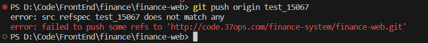

# 本地用自己的分支开发

```bash
git clone respourl
git checkout -b 自己的分支名
# 拉取远程指定分支的代码
git pull origin dev
```

# 拉取远程代码并合并

```bash
git checkout -b test  #新建分支
git pull origin dev  # 拉取分支代码
git checkout dev
git merge test
```

# 将本地修改后的代码提交到远程新分支



如果遇到上述错误，说明本地没有这个分支，可以如下操作

```bash
git add . # 将修改提交到暂存区
git commit -m '提交修改'  # 提交修改
git checkout -b test_15067 # 在本地新建分支
git pull origin test_15067 # 拉取远程分支的代码
git push origin test_15067 # 提交代码到远程仓库
```

# 远程仓库管理

```shell
git remote add <name> <url>  //添加远程仓库源
git remote rename <name> <newname>  //重命名源
git remote remove <name>  //删除远程仓库源
git remote -v   //查看本地远程仓库源
git branch -M <branchname>  
git push -uf <originname> <branch>  //强行提交代码
```
